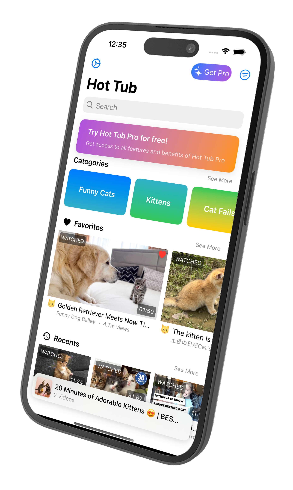

# **Hot Tub**

## Adult Video Player

  

    

    Hot Tub is a video player app, initially designed for the playback of adult content. Its API has been opened up for extensibility, allowing anyone to create, host, or deploy their own server, providing videos for playback within the app. This flexibility enables developers to integrate their own video sources and customize the user experience, making Hot Tub a versatile platform for video consumption.
    

    <b style="padding-bottom: 1rem;">
    Key Features:
    </b>
    

      <ul style="list-style-type: none; padding: 0; margin: 0;">
        <li>📱 iOS native</li>
        <li>👤 No account needed</li>
        <li>🎬 Video queue</li>
        <li>❤️ Favorites</li>
        <li>📺 Watch history</li>
      </ul>
      <ul style="list-style-type: none; padding: 0; margin: 0;">
        <li>🔐 Private & secure</li>
        <li>🔎 Advance search & filtering</li>
        <li>🌐 Multi-network support</li>
        <li>🚫 Ad-free</li>
        <li>💫 100% free</li>
      </ul>
    

  

  

- :fontawesome-solid-download: **Install Hot Tub**  
   Follow the instructions to install Hot Tub on your device.
  (install.md)

- :fontawesome-solid-server: **Deploy a Server**  
   Learn how to deploy your own server for Hot Tub.
  (server/deploy.md)

- :fontawesome-solid-question: **FAQ / Troubleshooting**  
   Find answers to common questions and troubleshooting tips.
  (faq.md)

